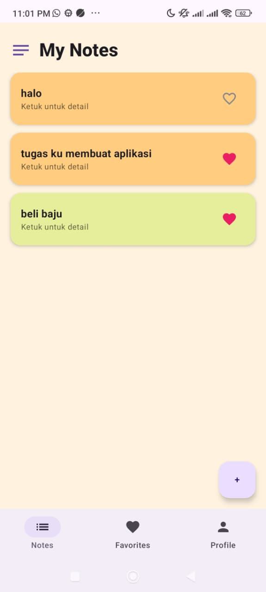
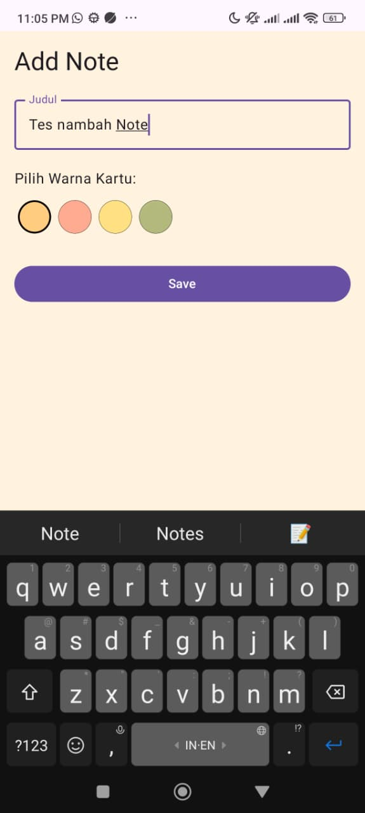
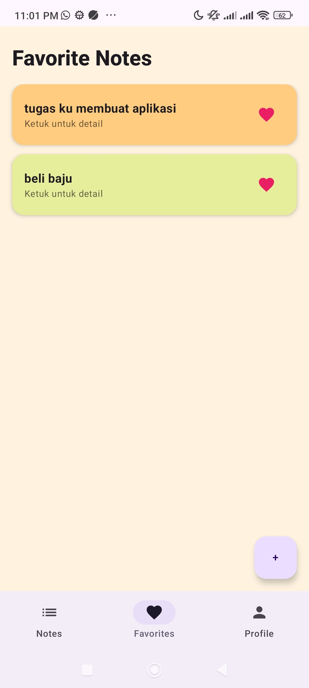
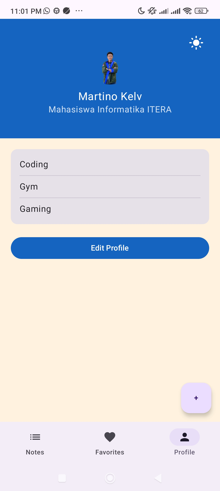

# Notes App - Multi-Screen Navigation (Tugas Minggu 5)

Proyek ini merupakan pengembangan dari aplikasi catatan (Notes App) menggunakan Compose Multiplatform. Fokus utama pada pertemuan ini adalah implementasi sistem navigasi antar layar, manajemen back stack, dan pengiriman data (arguments) antar destinasi.

## 📑 Struktur Proyek

Sesuai dengan panduan struktur folder yang diminta:

- **navigation/**: Berisi konfigurasi rute, sealed class layar, dan AppNavigation.
- **screens/**: Berisi UI untuk setiap fitur (Notes, Favorites, Profile).
- **components/**: Berisi komponen UI yang dapat digunakan kembali seperti BottomNavBar.
- **viewmodel/**: Berisi logika manajemen state menggunakan StateFlow.

## 🚀 Fitur Utama (Pertemuan 5)

- **Bottom Navigation**: Menggunakan Scaffold dengan 3 tab utama: Notes, Favorites, dan Profile.
- **Navigation with Arguments**: Implementasi pengiriman noteId dari daftar catatan ke layar detail dan edit.
- **Floating Action Button (FAB)**: Akses cepat untuk menambah catatan baru dari layar utama.
- **Local Storage (ViewModel)**: Data catatan disimpan dalam NoteViewModel agar tetap sinkron antar layar (Notes dan Favorites).
- **Customization**: Fitur memilih warna kartu (Card Color) saat menambah catatan dan integrasi fitur profil (Edit Profile & Dark/Light Mode) dari pertemuan sebelumnya.

## 🗺️ Diagram Alur Navigasi

Berikut adalah alur perjalanan pengguna dalam aplikasi:

- Notes Tab → Klik Note → Detail Note → Klik Edit → Edit Note.
- FAB → Add Note Screen.
- Bottom Navigation Switch: Menggunakan popUpTo dan launchSingleTop untuk navigasi tab yang efisien.

## 🎥 Video Demo

Silakan tonton video demo durasi 30 detik yang menunjukkan seluruh alur navigasi aplikasi:

[Tonton Video Demo di Sini](https://drive.google.com/file/d/15WAlCU42uKsS1telFeqh6VswnuWTF_8L/view?usp=drivesdk)

## 📸 Screenshots

### Notes List

### Add Note (Custom Color)

### Favorites Screen

### Profile (Dark Mode)

## 🛠️ Cara Menjalankan

1. Clone repository ini: `git clone -b week-5 https://github.com/username/repo-name.git`.
2. Buka di Android Studio (Ladybug atau versi terbaru).
3. Pastikan dependency navigation-compose sudah terpasang.
4. Jalankan aplikasi di Android Emulator atau perangkat fisak.

## Dibuat oleh:

- **Nama**: Martino
- **NIM**: 123140165
- **Prodi**: Teknik Informatika - ITERA
