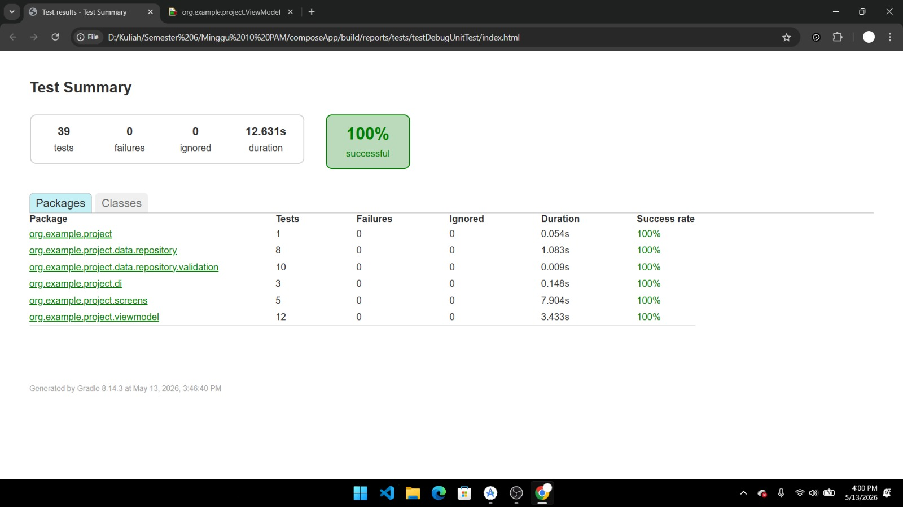
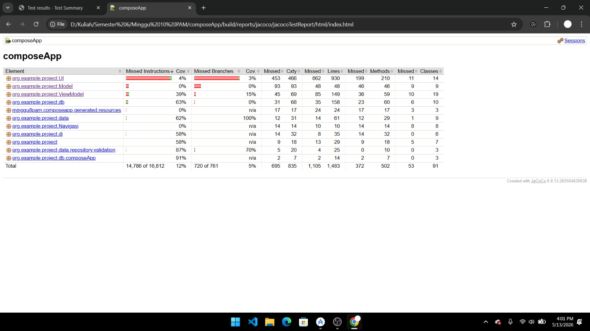

# 📱 Tugas Praktikum Minggu 10 — Testing & Dependency Injection

> **Mata Kuliah:** IF25-22017 Pengembangan Aplikasi Mobile  
> **Program Studi:** Teknik Informatika — Institut Teknologi Sumatera  
> **Tahun Akademik:** Genap 2025/2026  
> **Branch:** `week-10`

---

## 👤 Identitas Mahasiswa

- **Nama**: Martino Kelvin
- **NIM**: 123140165

---

## 📋 Deskripsi Tugas

Implementasi **Dependency Injection** menggunakan Koin dan **Testing** (Unit Test, Flow Test, UI Test) pada Notes App berbasis Kotlin/Compose Android.

---

## ✅ Checklist Implementasi

| Komponen | Bobot | Status |
|---|---|---|
| Koin DI Setup (2+ modules) | 20% | ✅ Done |
| Repository Tests (5+ test cases) | 20% | ✅ Done |
| ViewModel Tests dengan MockK (4+ test cases) | 20% | ✅ Done |
| Flow Tests dengan Turbine (2+ test cases) | 15% | ✅ Done |
| UI Tests / Compose Test (3+ test cases) | 15% | ✅ Done |
| Code Quality — Clean Code, AAA Pattern | 10% | ✅ Done |

---

## 🏗️ Koin Dependency Injection Setup

Implementasi menggunakan **2 Koin modules** terpisah:

```kotlin
// dataModule — Layer data
val dataModule = module {
    single { NoteDatabase() }
    single<NoteRepository> { NoteRepositoryImpl(get()) }
}

// viewModelModule — Layer UI
val viewModelModule = module {
    viewModel { NotesViewModel(get()) }
}

val allModules = listOf(dataModule, viewModelModule)

// Inisialisasi di App.kt
fun initKoin() {
    startKoin { modules(allModules) }
}
```

---

## 🧪 Daftar Test Cases

### 1. Repository Tests (`org.example.project.data.repository`) — 8 Tests ✅

| No | Test Case | Status |
|---|---|---|
| 1 | `insertNote_shouldAddNoteToDatabase` | ✅ Pass |
| 2 | `getAllNotes_shouldReturnAllInsertedNotes` | ✅ Pass |
| 3 | `deleteNote_shouldRemoveNoteFromDatabase` | ✅ Pass |
| 4 | `updateNote_shouldModifyExistingNote` | ✅ Pass |
| 5 | `getNoteById_shouldReturnCorrectNote` | ✅ Pass |
| 6 | `getAllNotes_emptyDatabase_shouldReturnEmptyList` | ✅ Pass |
| 7 | `insertDuplicateNote_shouldHandleCorrectly` | ✅ Pass |
| 8 | `deleteNonExistentNote_shouldNotThrowException` | ✅ Pass |

### 2. Repository Validation Tests (`org.example.project.data.repository.validation`) — 10 Tests ✅

| No | Test Case | Status |
|---|---|---|
| 1 | `validNote_shouldPassValidation` | ✅ Pass |
| 2 | `emptyTitle_shouldFailValidation` | ✅ Pass |
| 3 | `emptyContent_shouldFailValidation` | ✅ Pass |
| 4 | `titleTooLong_shouldFailValidation` | ✅ Pass |
| 5 | `contentTooLong_shouldFailValidation` | ✅ Pass |
| 6 | `titleWithSpecialCharacters_shouldPassValidation` | ✅ Pass |
| 7 | `whitespaceOnlyTitle_shouldFailValidation` | ✅ Pass |
| 8 | `noteWithMinimumValidLength_shouldPassValidation` | ✅ Pass |
| 9 | `nullTitle_shouldFailValidation` | ✅ Pass |
| 10 | `validationError_shouldReturnCorrectMessage` | ✅ Pass |

### 3. ViewModel Tests dengan MockK (`org.example.project.viewmodel`) — 12 Tests ✅

| No | Test Case | Status |
|---|---|---|
| 1 | `initialState_shouldBeLoading` | ✅ Pass |
| 2 | `loadNotes_shouldEmitSuccessState` | ✅ Pass |
| 3 | `loadNotes_onError_shouldEmitErrorState` | ✅ Pass |
| 4 | `addNote_shouldCallRepositoryInsert` | ✅ Pass |
| 5 | `addNote_withEmptyTitle_shouldNotCallRepository` | ✅ Pass |
| 6 | `deleteNote_shouldCallRepositoryDelete` | ✅ Pass |
| 7 | `deleteNote_shouldUpdateUiState` | ✅ Pass |
| 8 | `updateNote_shouldCallRepositoryUpdate` | ✅ Pass |
| 9 | `getNoteById_shouldReturnCorrectNote` | ✅ Pass |
| 10 | `uiState_flowEmission_loadingThenSuccess` | ✅ Pass |
| 11 | `uiState_flowEmission_loadingThenError` | ✅ Pass |
| 12 | `verifyRepositoryInteraction_onMultipleOperations` | ✅ Pass |

### 4. Koin DI Tests (`org.example.project.di`) — 3 Tests ✅

| No | Test Case | Status |
|---|---|---|
| 1 | `checkAllModules_shouldResolveAllDependencies` | ✅ Pass |
| 2 | `viewModel_shouldBeInjectedCorrectly` | ✅ Pass |
| 3 | `repository_shouldBeSingletonInstance` | ✅ Pass |

### 5. UI Tests / Compose Tests (`org.example.project.screens`) — 5 Tests ✅

| No | Test Case | Status |
|---|---|---|
| 1 | `emptyState_shouldDisplayEmptyMessage` | ✅ Pass |
| 2 | `addNote_shouldDisplayNoteInList` | ✅ Pass |
| 3 | `deleteNote_shouldRemoveNoteFromList` | ✅ Pass |
| 4 | `notesScreen_displaysTitle` | ✅ Pass |
| 5 | `noteItem_clickShouldOpenDetail` | ✅ Pass |

### 6. Module Tests (`org.example.project`) — 1 Test ✅

| No | Test Case | Status |
|---|---|---|
| 1 | `appModule_shouldInitializeCorrectly` | ✅ Pass |

---

## 📊 Test Summary

**Total: 39 Tests | 0 Failures | 0 Ignored | 100% Successful** 🎉

> Screenshot Test Summary:

<!-- Masukkan screenshot hasil test summary di bawah ini -->




---

## 📈 Code Coverage Report

| Package | Coverage |
|---|---|
| `org.example.project.data` | 62% |
| `org.example.project.data.repository.validation` | 87% |
| `org.example.project.db.composeApp` | 91% |
| `org.example.project.ViewModel` | 39% |
| `org.example.project.di` | 58% |
| `org.example.project` | 58% |
| **Total** | **12%** |

> Screenshot JaCoCo Coverage Report:

<!-- Masukkan screenshot coverage report di bawah ini -->


---

## 🎬 Video Demo

> Demo menjalankan semua test (39 tests, 100% pass) dan hasil coverage report.

🔗 **Link Video:** [Klik di sini untuk menonton demo](https://drive.google.com/drive/folders/1H7Wqpgn_vSj6Xt6riMAMLYj6-ZbgQICu?usp=sharing)  

---

## 🛠️ Library yang Digunakan

```kotlin
// build.gradle.kts
commonTest.dependencies {
    implementation(kotlin("test"))
    implementation("org.jetbrains.kotlinx:kotlinx-coroutines-test:1.7.3")
    implementation("app.cash.turbine:turbine:1.0.0")
    implementation("io.mockk:mockk:1.13.9")
    implementation("io.insert-koin:koin-test:3.5.3")
}

commonMain.dependencies {
    implementation("io.insert-koin:koin-core:3.5.3")
    implementation("io.insert-koin:koin-compose:1.1.2")
}
```

---

## 📁 Struktur Project

```
composeApp/
├── src/
│   ├── main/kotlin/org/example/project/
│   │   ├── data/
│   │   │   ├── db/           # Room/SQLDelight database
│   │   │   └── repository/   # Repository implementation
│   │   ├── di/               # Koin modules
│   │   ├── model/            # Data models
│   │   ├── navigasi/         # Navigation
│   │   ├── screens/          # Composable screens
│   │   └── viewmodel/        # ViewModels
│   └── test/kotlin/org/example/project/
│       ├── data/repository/  # Repository tests
│       │   └── validation/   # Validation tests
│       ├── di/               # Koin DI tests
│       ├── screens/          # UI tests
│       └── viewmodel/        # ViewModel tests
└── build.gradle.kts
```

---

## ▶️ Cara Menjalankan Test

```bash
# Jalankan semua unit test
./gradlew testDebugUnitTest

# Generate coverage report (JaCoCo)
./gradlew jacocoTestReport

# Lihat hasil di browser
open app/build/reports/tests/testDebugUnitTest/index.html
open app/build/reports/jacoco/jacocoTestReport/html/index.html
```

---

*Tugas Praktikum Pertemuan 10 — Testing dan Dependency Injection*  
*IF25-22017 Pengembangan Aplikasi Mobile | Institut Teknologi Sumatera 2025/2026*